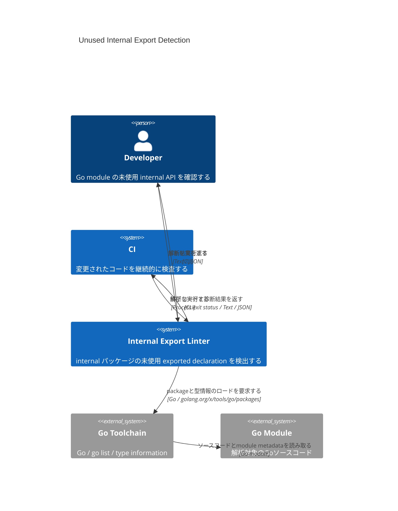
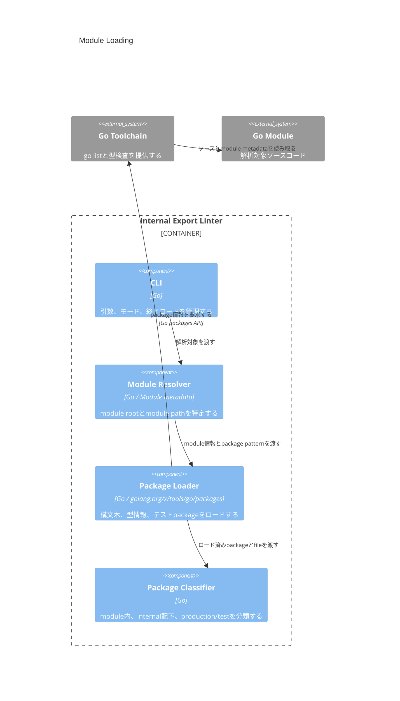
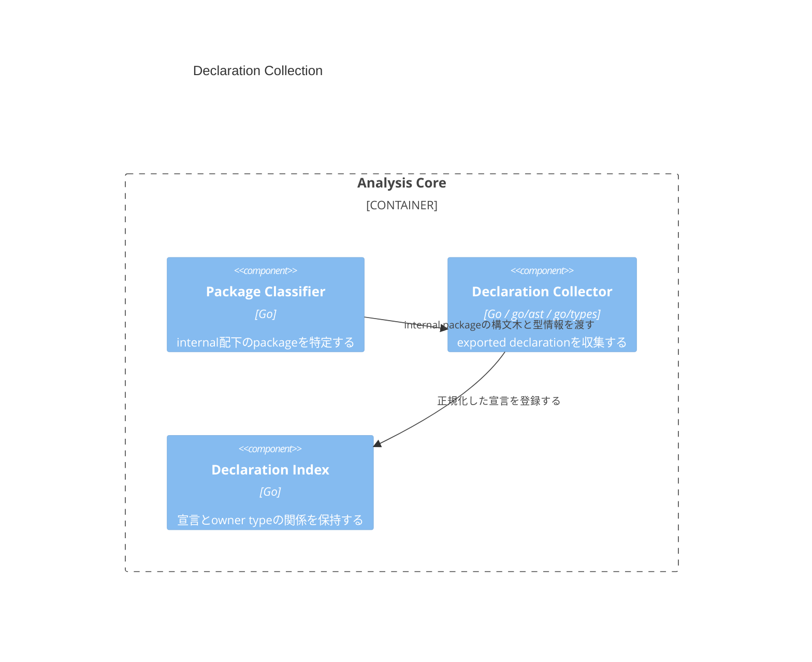
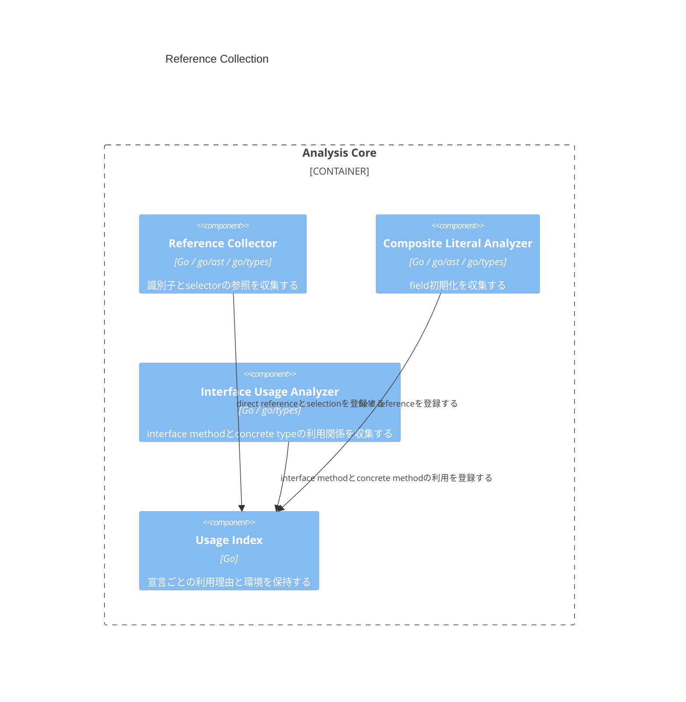
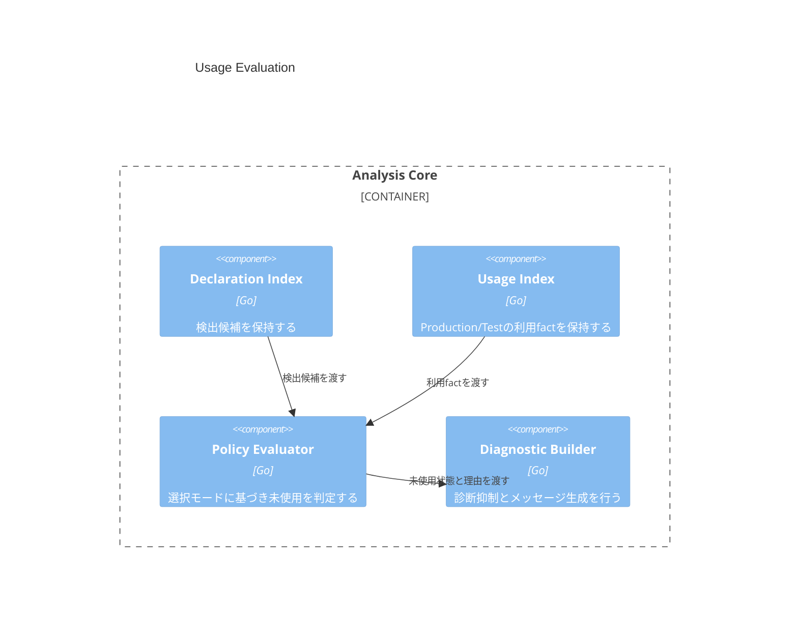
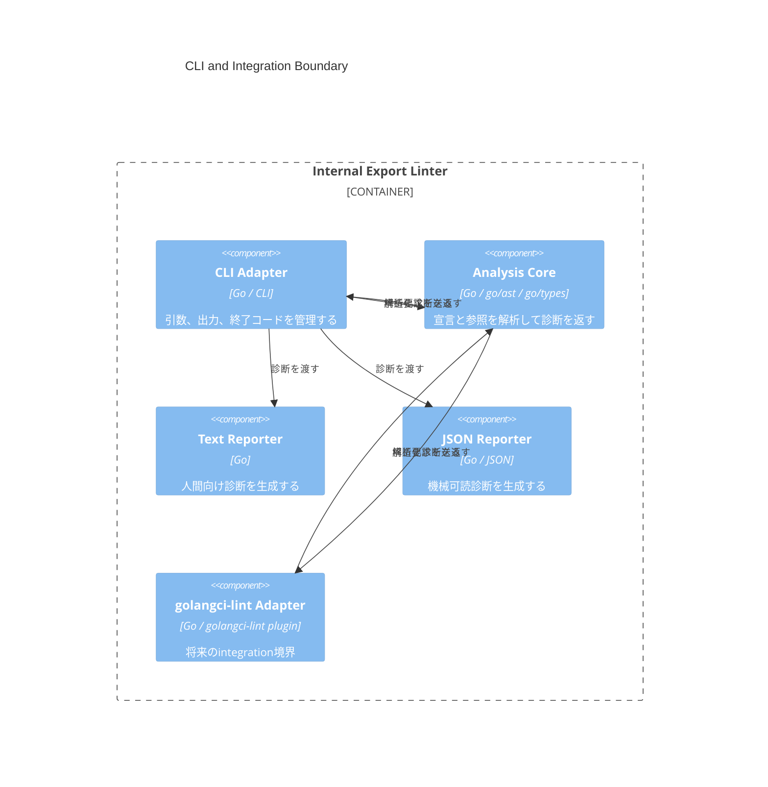

# DesignDoc: Detect Unused Exported Declarations in Internal Packages

**Document Status:** Draft
**Development Status:** TBD

## Abstract/Summary

Go module 内の `internal` パッケージに宣言された exported declaration について、module 内のコードから静的に参照されていない定義を検出する linter を提供する。初期実装は module 全体を解析する単独 CLI とし、プロダクションコードとテストコードの参照を区別して収集することで、完全な未使用定義とテストからのみ使用される定義の両方を検出可能にする。

### Detection Scope

| 項目              | 仕様                                                                                                  |
| ----------------- | ----------------------------------------------------------------------------------------------------- |
| 解析対象          | 1つの Go module                                                                                       |
| 宣言対象          | `internal` 配下の exported function、method、type、variable、constant、struct field、interface method |
| 参照元            | module 内のプロダクションコードおよびテストコード                                                     |
| デフォルトモード  | プロダクションコードまたはテストコードで使用されていれば使用済み                                      |
| Production モード | プロダクションコードで使用されていなければ検出                                                        |
| 暗黙的な利用      | reflection、serialization、文字列指定による利用は考慮しない                                           |
| 初期提供形態      | 単独 CLI                                                                                              |
| 将来の提供形態    | golangci-lint への組み込み                                                                            |

### Declaration Categories

| 種別             | 使用判定                                                                |
| ---------------- | ----------------------------------------------------------------------- |
| Function         | 対象の function object への直接参照                                     |
| Method           | method selection、method expression、またはinterface dispatchによる利用 |
| Type             | 型参照、埋め込み、生成、変換、型制約などによる参照                      |
| Variable         | 対象の variable object への直接参照                                     |
| Constant         | 対象の constant object への直接参照                                     |
| Struct field     | selector、composite literal、promoted selectionによる直接参照           |
| Interface method | 対象interfaceを通したmethod selectionまたは呼び出し                     |

### Detection Modes

| Mode         | Production reference | Test reference | 判定             |
| ------------ | -------------------: | -------------: | ---------------- |
| `all`        |                 なし |           なし | 未使用           |
| `all`        |                 なし |           あり | 使用済み         |
| `all`        |                 あり |           任意 | 使用済み         |
| `production` |                 なし |           なし | 未使用           |
| `production` |                 なし |           あり | テストのみで使用 |
| `production` |                 あり |           任意 | 使用済み         |

## Background

Go の exported declaration は、通常は未知の外部パッケージから利用される可能性があるため、module 内で直接参照されていなくても未使用とは断定できない。

一方、`internal` ディレクトリ配下のパッケージは、Go の import 制約によって利用可能な範囲が限定される。少なくとも同一 module 内の全コードを解析すれば、module 内における静的な利用状況を把握できる。

既存の未使用解析では、package 内の非公開定義や到達不能コードの検出は可能でも、`internal` パッケージの exported declaration をmodule単位で評価する用途を直接満たさない場合がある。

また、プロダクションコードでは使用されず、テストコードからのみ使用される exported declaration は、テスト用の補助 API なのか、プロダクションコードから削除された定義なのかを判断する材料になる。そのため、参照の有無だけでなく、参照元の実行環境を区別して収集する必要がある。

## Goals

- Go module 内の `internal` パッケージに宣言された、未使用の exported declaration を検出する。
- function、method、type、variable、constant、struct field、interface methodを検出対象とする。
- module 内の全パッケージを横断して利用状況を解析する。
- プロダクションコードとテストコードからの参照を区別する。
- 完全な未使用定義と、テストコードからのみ使用される定義を区別して診断する。
- 宣言収集、参照収集、利用判定、診断出力を分離し、検出ポリシーを変更可能にする。
- 初期実装を単独 CLI として提供する。
- 診断結果をCIで安定して利用できるようにする。

## Lower-Priority Goals

- golangci-lint に組み込める解析コンポーネントを提供する。
- JSONなどの機械可読な診断形式を提供する。
- 複数の `GOOS`、`GOARCH`、build tagsによる解析結果を統合する。
- 未使用判定の根拠や、参照された場所を表示する詳細診断を提供する。
- 宣言種別ごとの有効化・無効化を設定可能にする。
- suppression commentや設定ファイルによる明示的な除外を提供する。

## Non-Goals

- `internal` 配下ではない exported declaration の未使用判定。
- module 外のリポジトリや、解析対象moduleを依存先として利用する別moduleからの参照解析。
- reflectionによる動的な参照の検出。
- JSON、XML、ORM、DI、templateなどが名前やタグを用いて行う暗黙的なfield参照の検出。
- 文字列として記述された型名、method名、field名の参照解析。
- runtimeでロードされるpluginや生成コードによる利用の推測。
- 到達不能コードや、非exported declarationを含む一般的なdead codeの検出。
- 任意のbuild tagの組み合わせの自動列挙。
- GoDocが担うAPIレベルの説明の複製。

## Proposed Design

CLI、module loader、宣言・参照収集、利用判定、診断生成を分離する。解析結果を単純な未使用フラグとして保持せず、どの環境から、どのような理由で参照されたかをfactとして収集し、選択された検出モードによって最終判定する。

### Landscape

本linterはGo toolchainを利用してmoduleの構文木と型情報を取得し、`internal` パッケージのexported declarationとmodule内の参照関係を照合する。利用者またはCIはCLIを実行し、ソース位置に紐づいた診断結果を受け取る。



### Module Loading

CLIが受け取った解析対象からmodule rootを特定し、module 内のパッケージを1回の解析セッションとしてロードする。

同一解析セッション内で宣言と参照を収集し、異なるロード結果に含まれる型オブジェクトを混在させない。これにより、型と宣言の同一性を解析全体で維持する。

テストコードを含むロードを行い、通常パッケージ、内部テスト、外部テストを解析対象に含める。ただし、テスト実行のために生成されるmain packageなど、ユーザーが宣言したソースを持たない合成パッケージは診断対象に含めない。

解析対象はmodule pathおよびmodule root配下のファイルパスで制限する。依存moduleは型解決には利用するが、その宣言を検出候補には含めない。



#### Environment Classification

参照元はfile単位で次の環境に分類する。

| Environment | 対象                  |
| ----------- | --------------------- |
| Production  | 通常の `.go` ファイル |
| Test        | `*_test.go` ファイル  |

テスト用にロードされたpackageには、通常ファイルとテストファイルが同時に含まれる場合があるため、package単位ではなく参照元file単位で分類する。

同じ通常ファイルが通常packageとテスト用packageの両方に含まれる場合、同一参照を重複して記録しない。参照の意味は同一であるため、宣言、参照元位置、参照理由、環境からなる識別情報で正規化する。

#### テスト戦略

- 単一packageのmoduleをロードできることを確認する。
- 複数の`internal` packageと利用側packageを含むmoduleを確認する。
- 内部テストと外部テストの両方をTest環境として分類する。
- 通常ファイルがテスト用packageに重複して現れても、参照が重複しないことを確認する。
- 依存moduleのexported declarationが検出候補にならないことを確認する。
- module root外のpackageが検出対象にならないことを確認する。

### Declaration Collection

module 内の `internal` ディレクトリに属するpackageから、exported declarationを収集する。

packageが`internal`に属するかはpackage pathの文字列だけでなく、module rootからのディレクトリ構造を基準に判定する。パス構成要素として`internal`を含むディレクトリ配下を対象とし、単に名前へ`internal`を含むディレクトリは対象にしない。

収集対象は次のとおりとする。

- package-level function
- named type
- package-level variable
- package-level constant
- named typeに宣言されたmethod
- struct typeに宣言されたexported field
- interface typeに明示的に宣言されたexported method

型の埋め込みによって昇格したmethodやfieldは、新しい宣言として収集しない。宣言元のmethodまたはfieldを利用判定の対象とする。

alias declarationは型宣言として収集する。alias先の型の利用とalias自体の利用は別の宣言として扱う。

method、struct field、interface methodは所有するnamed typeとの関係を保持する。この所有関係は、親typeが未使用の場合の診断抑制に利用する。



#### テスト戦略

- すべての対象宣言種別が収集されることを確認する。
- 非exported declarationが収集されないことを確認する。
- `internal`以外のpackageの宣言が収集されないことを確認する。
- `internalized`など、パス構成要素ではない文字列を誤判定しないことを確認する。
- method、field、interface methodにowner typeが設定されることを確認する。
- promoted memberを重複した宣言として収集しないことを確認する。
- type aliasとalias先を異なる宣言として扱うことを確認する。

### Reference Collection

module 内のすべてのユーザーソースから、対象宣言への静的な参照を収集する。

参照は識別子の文字列比較ではなく、Goの型情報によって解決された宣言オブジェクトを基準に照合する。同名の定義、埋め込みによる昇格、method set、package aliasなどを名前だけで推測しない。

各参照は少なくとも次の情報を持つ。

| 情報       | 用途                                                                   |
| ---------- | ---------------------------------------------------------------------- |
| 対象宣言   | どのexported declarationが使われたか                                   |
| 参照元位置 | 診断根拠およびデバッグ                                                 |
| 環境       | ProductionまたはTest                                                   |
| 参照理由   | direct reference、selection、composite literal、interface dispatchなど |

#### Direct References

function、type、variable、constantへの識別子参照を収集する。

対象には次のような利用を含む。

- function call
- function value
- type annotation
- type conversion
- composite literalの型
- variable read/write
- constant expression
- generic type argument
- embedded type
- type constraintでの参照

宣言位置に現れる識別子は利用として数えない。

#### Method and Field Selections

selector expressionが解決したmethodまたはfieldを参照として収集する。

対象には次を含む。

- method call
- method value
- method expression
- field read/write
- field address
- promoted method selection
- promoted field selection

promoted selectionの場合、最終的に選択されたmemberだけでなく、そのmemberへ到達するために経由したembedded fieldも使用済みとして扱う。

これにより、埋め込みを通じてのみ利用されるfieldを未使用として誤検出することを防ぐ。

#### Composite Literals

key付きcomposite literalでは、field keyとして指定されたfieldを使用済みとする。

keyなしcomposite literalでは、literalの要素位置とstruct fieldの宣言順を対応させ、値が指定されたexported fieldを使用済みとする。

別packageからkeyなしでstruct literalを構築することはGoの言語仕様上制約されるため、主に宣言package内での利用が対象となる。

#### Struct Field Policy

exported struct fieldは、struct tagの有無にかかわらず直接参照がなければ検出する。

次の利用は直接参照として扱う。

- selectorによるfield access
- key付きcomposite literal
- keyなしcomposite literal
- promoted selectorの経路
- embedded fieldとして必要になるselection

次の利用は考慮しない。

- struct tagを読むserializer
- field名を使うreflection
- JSON、XML、database、validation、templateなどによる暗黙的な利用
- 文字列として指定されたfield名

この方針によりfalse positiveが発生する可能性はあるが、静的に確認可能な利用だけを使用済みとする一貫した判定を優先する。

#### Interface Method References

interface methodは、対象interface型を通したmethod selectionまたはmethod expressionが存在する場合に使用済みとする。

concrete typeの同名methodが直接使用されていても、それだけではinterface methodの使用とはみなさない。

interface type自体が未使用の場合は、配下のinterface methodの診断を抑制する。

#### Interface Dispatch

interface型を通してmethodが呼び出された場合、ソースコード上で直接参照されるのはinterface methodであり、実行時に選択されるconcrete methodは直接参照されない。

この利用を反映するため、解析中に次の関係を収集する。

- concrete valueからinterface型への代入
- concrete valueのinterface引数への受け渡し
- concrete valueのinterface戻り値としての返却
- 明示的なinterface変換
- interface valueを格納するcomposite literalやcontainerへの代入

使用されているinterface methodと、実際にそのinterfaceとして扱われたconcrete typeのmethod setを照合し、対応するconcrete methodへ利用を伝播する。

単にconcrete typeがinterfaceを実装可能であるだけでは、そのmethodを使用済みとしない。concrete typeが解析対象コード上でそのinterfaceとして利用されていることを必要条件とする。



#### テスト戦略

- function callとfunction valueの両方を使用として扱う。
- type annotation、conversion、embedding、generic argumentを使用として扱う。
- variableのreadとwriteを使用として扱う。
- method call、method value、method expressionを使用として扱う。
- field access、field assignment、field addressを使用として扱う。
- key付き・keyなしcomposite literalのfield利用を確認する。
- promoted selectionの経路にあるembedded fieldを使用として扱う。
- concrete methodの利用だけではinterface methodを使用済みにしない。
- interface経由の利用を対応するconcrete methodへ伝播する。
- 実装可能だがinterfaceとして使われていないconcrete methodへ利用を伝播しない。
- reflectionやstruct tagだけの利用ではfieldを使用済みにしない。

### Usage Evaluation

収集したfactと選択された検出モードから、各宣言の利用状態を評価する。

利用状態はProductionとTestの2つの独立したフラグとして保持する。判定処理は参照収集時にモードを意識せず、すべての利用factを収集した後で適用する。



#### All Mode

ProductionまたはTestのいずれかに利用があれば使用済みとする。

両方に利用がなければ完全な未使用として診断する。

#### Production Mode

Productionに利用があれば使用済みとする。

Productionに利用がなくTestにのみ利用がある場合は、完全な未使用とは異なる「テストのみで使用」の診断を生成する。

ProductionとTestの両方に利用がなければ完全な未使用として診断する。

#### Parent Diagnostic Suppression

named typeが未使用として診断される場合、そのtypeに所有される次の診断を抑制する。

- method
- struct field
- interface method

例えば未使用typeが複数の未使用fieldとmethodを持つ場合でも、typeに対する診断だけを表示する。

この抑制は診断生成時に適用する。内部の利用状態は子宣言についても保持し、将来の詳細出力やデバッグに利用可能とする。

親typeが使用済みの場合は、未使用のfield、method、interface methodを個別に診断する。

#### Diagnostic Stability

診断は次の順序で安定して並べる。

1. ファイルパス
2. 行
3. 列
4. 宣言種別
5. 宣言名

解析時のmap iterationやpackage load順序に出力が依存しないようにする。

#### テスト戦略

- `all`モードでTestのみの利用を使用済みと判定する。
- `production`モードでTestのみの利用を診断する。
- 完全な未使用とTestのみの利用を異なる理由として保持する。
- 未使用type配下のmember診断を抑制する。
- 使用中type配下の未使用memberは診断する。
- package load順序にかかわらず診断順序が一定であることを確認する。

### CLI and Diagnostics

初期実装は単独CLIとして提供する。CLIは入力の解決、解析モードの選択、診断形式、終了コードを管理し、解析ロジックを持たない。

基本的な利用形式は次の形とする。

```text
internalunused [flags] [package patterns]
```

package patternが省略された場合にmodule全体を対象とするか、明示的なpatternを必須とするかはOpen Questionsで決定する。

検出モードは少なくとも次を提供する。

```text
--mode=all
--mode=production
```

デフォルトは誤検出を抑えやすい`all`とする。

診断には次の情報を含める。

- ファイルパス
- 行と列
- 宣言種別
- qualified declaration name
- 未使用理由
- machine-readableな診断識別子

診断例：

```text
internal/parser/parser.go:12:6: exported function Parse is unused
```

```text
internal/parser/parser.go:12:6: exported function Parse is only used by tests
```

終了コードは少なくとも次を区別する。

| 状態                      | 終了コードの意味  |
| ------------------------- | ----------------- |
| 診断なし                  | 成功              |
| 未使用定義を検出          | lint failure      |
| module loadまたは解析失敗 | execution failure |

具体的な数値はCLI規約として実装時に定義する。

#### Analysis Core Boundary

CLIと将来のgolangci-lint integrationは、同じ解析コアを利用する。

解析コアは次を入力として受け取る責務を持つ。

- moduleおよびpackageの解析結果
- 検出モード
- 対象範囲と除外設定

解析コアは環境依存の標準出力、終了コード、CLI argument parsingを扱わず、構造化された診断を返す。

この境界により、単独CLIで実装した解析ロジックをgolangci-lint向けに再利用できる。



#### テスト戦略

- CLI argument parsingと解析コアを分離してテストする。
- 診断あり、診断なし、解析失敗の終了状態を確認する。
- 出力順序とパス表現が安定していることを確認する。
- text reporterの出力をgolden testで確認する。
- 解析コアが標準出力やprocess terminationへ依存しないことを確認する。

### Error Handling

moduleまたはpackageのロードに失敗した場合、解析結果を部分的にlint結果として扱わず、解析失敗として報告する。

型エラーを含むpackageについて解析を継続するかは、誤った未使用診断を避けるため保守的に扱う。対象moduleの型情報が完全に構築できない場合、原則としてlint failureではなくexecution failureとする。

一部のbuild対象外ファイルや依存moduleの問題によって解析可能なpackageだけを継続するpartial analysisは、診断の完全性を保証しにくいため初期実装では行わない。

エラー出力には、少なくとも次を含める。

- 失敗したpackageまたはfile
- Go toolchainから得られた原因
- lint診断ではなく解析失敗であること

#### テスト戦略

- 構文エラーを含むmoduleでexecution failureになることを確認する。
- 型エラーを含むmoduleで不完全なlint診断を返さないことを確認する。
- 存在しないpackage patternを適切に報告する。
- Go moduleではないディレクトリからの実行を適切に報告する。

## Alternatives Considered

### Package-Local Analysis

各`internal` packageだけを個別に解析し、同一package内で参照されていないexported declarationを検出する案。

exported declarationは他packageから利用されることを目的とするため、package-local analysisでは正当な利用を検出できず、多数の誤検出が発生する。このため採用しない。

### Internal Directory-Local Analysis

同一`internal`ディレクトリ配下からの参照だけを解析する案。

`cmd`、`pkg`、module root直下など、`internal`外のmodule内packageから正当に利用されるケースを見落とすため採用しない。

### Name-Based Reference Matching

AST上の識別子名やselector名を文字列で照合する案。

同名宣言、package alias、埋め込み、method set、interface methodを正確に識別できないため採用しない。Goの型情報によって解決された宣言オブジェクトを利用する。

### Treat Any Interface Implementation as Usage

concrete typeがmodule内のinterfaceを実装可能であれば、そのmethodをすべて使用済みとする案。

偶然同じmethod setを持つだけの型や、実際にはinterfaceとして使われていない型まで使用済みになり、不要なmethodを見逃す。このため、interfaceとしての実利用を必要条件とする。

### Ignore Tagged Struct Fields

struct tagを持つexported fieldはreflectionやserializationで利用される可能性が高いため、検出対象外にする案。

タグの存在だけでは実際の利用を示さず、不要になったfieldが残り続ける。また、タグなしfieldもreflectionで利用される可能性があるため、タグの有無を境界にすると判定原則が一貫しない。静的な直接参照だけを使用とみなし、タグ付きfieldも検出対象とする。

### Report Every Unused Member

未使用typeと、その配下にあるすべての未使用field・methodを個別に報告する案。

typeを削除すれば配下の診断も同時に解消されるため、診断数が増えて主要な問題が見えにくくなる。親typeが未使用の場合は子memberの診断を抑制する。

### Build Directly as a golangci-lint Plugin

初期段階からgolangci-lint integrationとして実装する案。

module全体解析、テスト環境の分類、interface dispatchの伝播などの解析モデルを検証する前にintegration固有の制約を負うことになる。解析コアを独立させた単独CLIとして開始し、安定後にadapterを追加する。

### Use `go/analysis` Facts as the Primary Architecture

package単位のAnalyzerとfacts伝搬だけでmodule全体の宣言と参照を集約する案。

将来のgolangci-lint integrationには適合しやすい一方、初期実装ではmodule全体の宣言集合と参照集合を一括して評価する方が設計を単純に保ちやすい。解析コアを独立させ、必要になった段階で`go/analysis` adapterを検討する。

## Open Questions

- interfaceへの利用関係をどの構文まで追跡するか。
  - 変数代入、引数、戻り値、明示的変換は対象とする。
  - generic container、interfaceを含むstruct field、複数段階のdata flowまで追跡するかは未決定。

- interface valueが別のinterfaceへ変換された場合、concrete methodへの利用伝播をどの範囲まで行うか。
- 現在の`GOOS`、`GOARCH`、build tagsだけを解析するか。
  - 初期案は実行時のbuild contextだけを解析し、複数環境の統合はLower-Priority Goalとする。

- package patternを省略した場合にmodule全体を暗黙的に解析するか、`./...`などの明示指定を必須とするか。
- generated fileを通常の参照元および宣言元として扱うか。
  - デフォルトで含める案と、生成コードを除外可能にする案がある。

- `//go:linkname`による参照をどのように扱うか。
- cgoによって外部コードから参照されるexported declarationをどのように扱うか。
- suppression commentの形式と適用単位をどのようにするか。
- 初期バージョンでJSON出力を提供するか。
